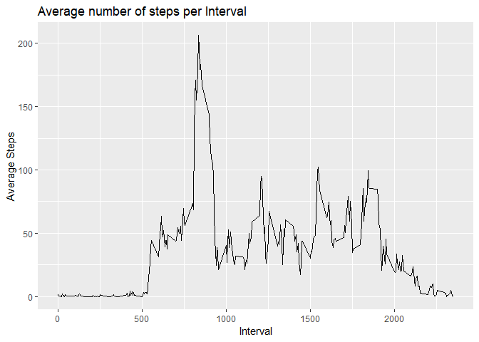

Set the global option so that echo is always set to True - this will always display the code chunks.

```r
library(knitr)
opts_chunk$set(echo = TRUE)
```

## Loading and preprocessing the data
Unzip the actvity.zip data file and load into "act"

```r
unzip("activity.zip")
act <- read.csv("activity.csv")
```


## What is mean total number of steps taken per day?
Ignore missing values for this part.

First we need to aggregate the number of steps for each day (61 days)

```r
stepDate <- aggregate(act$steps, by = list(date = act$date), sum)
```

Now show a histogram of the number of steps for each day

```r
library(ggplot2)
ggplot(stepDate, aes(x  = x)) +
        geom_histogram() + 
        xlab("Steps") +
        labs(title = "Histogram of steps per day")
```

```
## `stat_bin()` using `bins = 30`. Pick better value with `binwidth`.
```

```
## Warning: Removed 8 rows containing non-finite values (stat_bin).
```

<!-- -->

Then we need to calculate the mean and median steps per day

```r
meanStep <- round(mean(stepDate$x, na.rm = T),3)
medianSteps <- median(stepDate$x, na.rm = T)
```

The mean number of daily steps is 10766.19 and the median number of daily steps is 10765

## What is the average daily activity pattern?
First create a data frame containing the average number of steps for each interval

```r
avgSteps <- aggregate(act$steps, by = list(interval = act$interval), mean, na.rm = T)
```

Now create a line plot which looks at the average number of steps per interval, averaged over all days

```r
ggplot(avgSteps, aes(x = interval, y = x, group = 1)) +
        geom_line() +
        xlab("Interval") +
        ylab("Average Steps") +
        labs(title = "Average number of steps per Interval")
```

<!-- -->

Which 5 minute interval, averaged across all days has the highest average number of steps


```r
avgSteps[which(avgSteps$x == max(avgSteps$x)),]$interval
```

```
## [1] 835
```

## Imputing missing values
Calculate and report the otal number of missing values in the dataset

```r
sum(is.na(act$steps))
```

```
## [1] 2304
```

Now we know the number, create a data frame of all of the observations with NA' and a second one with the non na observstions. Use the second one to impute the NA's based on data we have. We will calculate the mean of each interval and apply it to the missing data. Finally create a new data frame called newAct which will have 0 NA's 

```r
# Get the missing data
missingData <- act[which(is.na(act$steps) == TRUE),]

# Get the data with no missing values
correctData <- act[!is.na(act$steps), ]

# Create imputed by calculating the mean of the intervals
imputed <- aggregate(correctData$steps, by = list(interval = correctData$interval), mean)

# add the imputed column to the end of the missing data to created fixed data
fixedData <- merge(x = missingData, y = imputed, by = "interval")

# remove the NA values
fixedData <- fixedData[, -2]

# Reorder the data frame to allow binding
fixedData <- fixedData[, c(3,2,1)]

# Rename x to steps to allow binding
colnames(fixedData)[1] <- "steps"

# Create the new table with no NA's
newAct <- rbind(correctData, fixedData)
```
Now we re-do the initial it of analysis from part 1 to see if the values are any different

```r
stepDateNew <- aggregate(newAct$steps, by = list(date = newAct$date), sum)
```

Show a histogram of the number of steps for each day

```r
library(ggplot2)
ggplot(stepDateNew, aes(x  = x)) +
        geom_histogram() + 
        xlab("Steps") +
        labs(title = "Histogram of steps per day")
```

```
## `stat_bin()` using `bins = 30`. Pick better value with `binwidth`.
```

<!-- -->

Calculate the mean and median steps per day

```r
meanStepNew <- round(mean(stepDateNew$x),3)
medianStepsNew <- median(stepDateNew$x)
```

The mean number of daily steps is 10766.19 and the median number of daily steps is 10766.19


## Are there differences in activity patterns between weekdays and weekends?
We need to create a new column to hold whether the date is a weekday or weekend. To do this, we first determine the weekday from each of the dates in the data frame. We then use gsub to search for specific days and convert them to either weekday or weekend.

The final step is to then coerce the new column to a factor so we can split our chart.


```r
# Get the weekedays from the date
newAct$weekDay <- weekdays(as.Date(newAct$date, format = "%Y-%m-%d"), abbr = T)

# Use gsub to replace Sat and Sun with Weekends
newAct$weekDay <- gsub(paste(unlist(list("Sat","Sun")), collapse = "|"),"Weekend", newAct$weekDay)

# Now Repeat with other days for Weekday
newAct$weekDay <- gsub(paste(unlist(list("Mon","Tue","Wed","Thu","Fri")), collapse = "|"),"Weekday", newAct$weekDay)

# Coerce the new column to a factor
newAct$weekDay <- as.factor(newAct$weekDay)
```

The final step is to create a new data frame with the mean steps by interval, by the weekend/weekday variable. Then finally produce a panel plot to display this data split by the weekday/weeked.

```r
weekDayAvgSteps <- aggregate(newAct$steps, by = list(interval = newAct$interval, day = newAct$weekDay), mean)


qplot(interval, x, data = weekDayAvgSteps, geom = "line") +
        facet_wrap(~ day, nrow = 2) +
        xlab("Interval") +
        ylab("Number of Steps (Mean)")
```

<!-- -->
